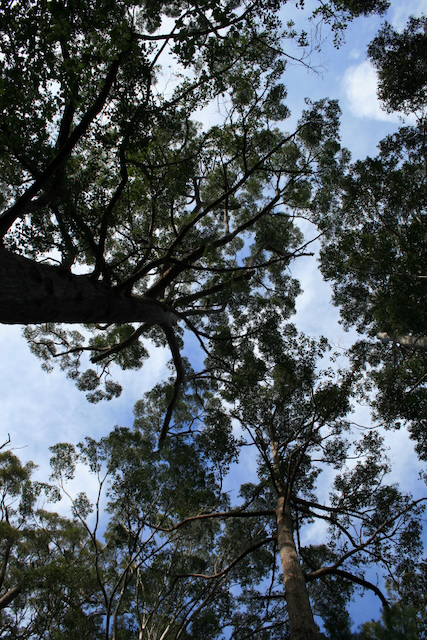

  
```{r setup, include=FALSE}
library(learnr)
library(sf)
library(terra)
library(dplyr)
library(ggplot2)
library(rnaturalearth)
library(rnaturalearthdata)
library(geodata)
library(gradethis)
knitr::opts_chunk$set(echo = FALSE)
gradethis::gradethis_setup()
tutorial_options(exercise.completion = FALSE)
```

## Advanced Spatial Data in R

This tutorial builds on basic R skills for working with vector and raster data in R, with an emphasis on preparing and combining vector and raster data from different sources. The goal is to produce a final data set that contains both biological and environmental data with a structure suitable for spatial analyses and modeling.

In addition to the using the `sf` and `terra` packages, we will also use the `geodata` package to download species occurrence data from the [Global Biodiversity Information Facility (GBIF)](http://gbif.org) (http://gbif.org), a massive online "database of databases" housing billions of biodiversity records. We will use the `rnaturalearth` package to download country boundaries and `ggplot2` to make maps.

The `geodata` package provides functions for downloading a suite of geographic data for use in spatial analysis, mapping, and modeling, providing access to spatial data on climate, crops, elevation, land use, soil, species occurrence, accessibility, administrative boundaries and other data. If you need geographic data for a project, `geodata` is a great place to start. 

### Exercise 1 - Retrieving & preparing species occurrence data from GBIF

The `geodata` package provides a function `sp_occurrence` to download species occurrence data from GBIF. We will retrieve data for karri (*Eucalyptus diversicolor*), an endemic tree from southwest Australia and one of the tallest tree species in the world.

```{r karri-image, echo=FALSE, out.width="49%", out.height="30%", fig.cap="A towering stand of Eucalyptus diversicolor in southwest Australia. Photo credit: MC Fitzpatrick", fig.show='hold', fig.align='center'}

```

We set the `download` argument to `TRUE` to download the data (as opposed to returning just the number of records available in GBIF) and the `geo` argument to `TRUE` to return the only records that have geographic coordinates. We also set `removeZeros` to `TRUE` to remove records that have coordinates = 0 (which would place those records at the intersection of the prime meridian and the equator in the ocean of the coast of West Africa). Check `?sp_occurrence` for more information on the function.

```{r download-karri, exercise=TRUE, exercise.lines = 15, exercise.eval = T}
# get data for karri using geodata::sp_occurrence
karri <- geodata::sp_occurrence(genus="Eucalyptus",
                       species="diversicolor",
                       download=T,
                       geo=T,
                       removeZeros = T)
```

Let's have a look at the data. 
                    
```{r check-karri, exercise=TRUE, exercise.lines = 15, exercise.eval = T, exercise.setup = "download-karri"}
# check the data
class(karri)
#  
# check the dimensions
dim(karri)
#  
# see how many records from different datasets
table((karri$datasetName))
```

The `karri` object is a `data.frame` with 151(!) columns. We need to convert it to an `sf` object - but first, let's keep just a few useful columns. Also, we will want to know what CRS the coordinates are in, which is stored in the `geodeticDatum` column.

```{r karri-crs, exercise=TRUE, exercise.lines = 15, exercise.eval = T, exercise.setup = "download-karri"}
# check which CRS(s) the data is in
unique(karri$geodeticDatum)
```

#### **Write R code to perform the following tasks:**  
1. Use `dplyr::select` and function(s) from the `sf` package to produce a new data set named `karri.sf` that contains the needed coordinate columns and the attributes `species`, `country`, `year`, and `coordinateUncertaintyInMeters`. 
2. Assign the CRS information to the `karri.sf` object. Recall that the data is in WGS84 and the EPSG code for WGS84 is 4326. 
3. Print the the `karri.sf` object to check the results.
 
```{r karri-sf, exercise=TRUE, exercise.lines = 15, exercise.eval = T, exercise.setup = "download-karri"}

```

```{r karri-sf-solution}
# use dplyr::select to select only the columns we need
karri.sf <- karri %>%
  select(species, country, lon, lat, year, coordinateUncertaintyInMeters)

# convert to sf object
karri.sf <- sf::st_as_sf(karri.sf, coords = c("lon", "lat"))

# assign CRS information
sf::st_crs(karri.sf) <- 4326

# print the data
print(karri.sf)
```
 
```{r karri-sf-code-check}
grade_code()
```

```{r karri-clean-0, exercise.eval=T, exercise=T, echo=FALSE, message=FALSE, results='hide', exercise.setup="check-karri"}
# use dplyr::select to select only the columns we need
karri.sf <- karri %>%
  select(species, country, lon, lat, year, coordinateUncertaintyInMeters)

# convert to sf object
karri.sf <- sf::st_as_sf(karri.sf, coords = c("lon", "lat"))

# assign CRS information
sf::st_crs(karri.sf) <- 4326
```

Next, let's do a bit more cleaning to remove duplicates, which can be common with GBIF data, and points with low coordinate precision or NAs. To check the data, we will use `ggplot` to produce a global map of the records with countries in the background.

```{r karri-clean, exercise=TRUE, exercise.lines = 15, exercise.eval = T, exercise.setup = "karri-clean-0"}
# remove duplicates
karri.sf <- karri.sf[!duplicated(karri.sf),]

# remove records with coordinate precision = NA
karri.sf <- karri.sf[!is.na(karri.sf$coordinateUncertaintyInMeters),]

# remove records with low coordinate precision (>10km) using dplyr::filter
karri.sf <- dplyr::filter(karri.sf, coordinateUncertaintyInMeters < 10000)

# plot the data
world <- rnaturalearth::ne_countries(scale = "medium", returnclass = "sf")
ggplot() +
  geom_sf(data = world) +
  geom_sf(data = karri.sf, aes(color = species)) +
  theme_minimal()
```

### Exercise 2 - Cleaning records and spatial subsetting

The map shows the distribution of karri records across the globe, which reveals some interesting patterns. In particular, we know that karri is endemic to southwestern Australia and so any record outside that region is either an error (i.e., misidentification) or an individual planted outside its native range. 

Lets retain only those records within the known native range of karri. We will use a `shapefile` of the southwest Australia region to spatially subset the data. 

```{r sw-poly, exercise=TRUE, exercise.lines = 15, exercise.eval = T, exercise.setup = "karri-clean"}
# polygon for sw Aus
swPoly <- st_read("data/swPoly.shp")

# plot the data
plot(swPoly)
```

We can use `sf::st_intersection` to select points that fall within the `swPoly` polygon. 

```{r karri-overlay, exercise=TRUE, exercise.lines = 15, exercise.eval = T, exercise.setup = "sw-poly"}
# select points that fall within the sw polygon
karri.sw <- try(sf::st_intersection(karri.sf, swPoly))

```

```{r crs-quiz, echo=F}
quiz(
  question("Why did we get an error?",
    answer("We didn't define the CRS of the swPoly object."),
    answer("We used the wrong function. We should have used `st_overlaps` instead of `st_intersection`."),
    answer("The objects do not have the same CRSs.", correct = TRUE),
    allow_retry = TRUE))
```

#### **Write R code to perform the following tasks:**  
1. Check the CRS of `swPoly`. 
2. Transform the data so `karri.sf` and `swPoly` are in the same CRS. 
3. Use `st_intersection` to select only the records that fall within the `swPoly` polygon. 
4. Plot the data using `ggplot`. 
 
```{r transform-swPoly-quiz, exercise=TRUE, exercise.lines = 15, exercise.eval = T, exercise.setup = "sw-poly"}

```

```{r transform-swPoly-quiz-solution}
# determine the CRS of swPoly
st_crs(swPoly)

# transform the data
swPolyProj <- st_transform(swPoly, 4326)

# select points that fall within the sw polygon
karri.sw <- sf::st_intersection(karri.sf, swPolyProj)

#plot the data using ggplot
ggplot() +
  geom_sf(data = swPolyProj) +
  geom_sf(data = karri.sw, aes(color = species)) +
  theme_minimal()
```
 
```{r transform-swPoly-quiz-check}
grade_code()
```

```{r transform-swPoly, exercise.eval=T, exercise=T, echo=FALSE, results='hide', message=FALSE, exercise.setup="sw-poly"}
# determine the CRS of swPoly
st_crs(swPoly)

# transform the data
swPolyProj <- st_transform(swPoly, 4326)

# select points that fall within the sw polygon
karri.sw <- sf::st_intersection(karri.sf, swPolyProj)
```

### Exercise 3 - Downloading and cropping raster data

Next, we will download and work with raster data. We will use the `geodata` package to download global bioclimatic variables at 10 arc-minute resolution from the [WorldClim](http://worldclim.org) database. We will then crop these data to the extent of Australia and extract values for the karri records. 

```{r download-raster, exercise=TRUE, exercise.lines = 15, exercise.eval = T, exercise.setup = "transform-swPoly"}
# download the global bioclim rasters at 10 arc-minute resolution.
# NOTE: worldclim_global() takes var/res/path - there is no country argument,
# so this downloads the global dataset, which we crop to Australia below.
# The files are cached in ~/data, so this only downloads once.
bioclimVars <- geodata::worldclim_global(res = 10, var = "bio", path="~/data")

# the layers arrive with long names like "wc2.1_10m_bio_1" - rename them to
# bio1...bio19 so they are easier to refer to later
names(bioclimVars) <- paste0("bio", 1:19)

# check the data
bioclimVars

# class
class(bioclimVars)

# plot the stack
plot(bioclimVars)
```

The `bioclimVars` object is a stack of rasters with 19 layers. We can use the `terra::crop` function to crop the data to the extent of Australia. You can crop rasters a number of ways, including using a vector polygon (e.g., downloaded using `rnaturalearth`) or by providing coordinates for the limits (extent) of the region of interest. You can also uses `terra::draw()` to draw a polygon on the map and use that to crop the data. 

```{r crop-raster, exercise=TRUE, exercise.lines = 15, exercise.eval = T, exercise.setup = "download-raster"}
# spatial extent of Australia
#ausExt <- rnaturalearth::ne_countries(scale = "medium", #returnclass = "sf") %>%
#  filter(name == "Australia")

# extent using coordinates
ausExt <- c(110, 155, -45, -10)

# crop the data to the extent of Australia
ausBioclim <- terra::crop(bioclimVars, ausExt)

# plot the stack
plot(ausBioclim)
```

If we wanted to crop a raster to the exact boundaries of a polygon, we can set the argument `mask=TRUE`.

```{r mask-raster, exercise=TRUE, exercise.lines = 15, exercise.eval = T, exercise.setup = "crop-raster"}
# mask the data to the extent of the swPoly polygon
ausBioclimMasked <- terra::crop(ausBioclim, swPolyProj, mask=T)

# plot the stack
plot(ausBioclimMasked)
```

### Exercise 4 - Extracting raster values for karri records

Now that we have the bioclimatic data cropped to the extent of Australia, we can extract the values for the karri records. We will use the `terra::extract` function to extract the values for each of the 19 bioclimatic variables for each record. We set the argument `cells=TRUE` to extract the cell IDs for each record, which can be useful for further analyses. 

```{r extract-raster, exercise=TRUE, exercise.lines = 15, exercise.eval = T, exercise.setup = "mask-raster"}
# extract the values for the karri records
karri.bioclim <- terra::extract(ausBioclimMasked, karri.sw, cells=TRUE)

# check the data
head(karri.bioclim)

# summarize the extracted data. Any NAs?
summary(karri.bioclim)
```

#### **Write R code to perform the following tasks:**  
1. Remove any records with NA values. 
2. Add the raster values to the `karri.sw` object. In other words, make these data additional attributes of `karri.sw`.
3. Save the final attribute and geographic data of `karri.sw` to a comma-separated file (.csv) for further analysis.
 
```{r final-table-quiz, exercise=TRUE, exercise.lines = 15, exercise.eval = T, exercise.setup = "extract-raster"}

```

```{r final-table-quiz-solution}
# remove records with NA values
karri.bioclim <- karri.bioclim[!is.na(karri.bioclim$bio1),]

# add the raster values to the karri.sw object
karri.sw <- cbind(karri.sw, karri.bioclim)

# save the final data to a csv file
# written to tempdir() so the tutorial does not write into your working directory
write.csv(karri.sw, file.path(tempdir(), "karri_final.csv"))
```
 
```{r final-table-quiz-check}
grade_code()
```

### Exercise 5 - Sampling background climate with `spatSample()`

You now know the climate *at* the places karri has been observed. On its own that tells you very
little: to say anything about the species' climatic niche you need something to compare it
against - the range of climates that are *available* across the region. If karri occurs where
rainfall is 1000 mm, that only becomes interesting once you know whether most of Australia is
wetter or drier than that.

The standard way to build that comparison is to draw a random sample of cells from the raster
stack. `terra::spatSample()` does exactly this. The sample stands in for the available
("background") climate, and its `size` argument controls how many cells you draw.

```{r background-sample, exercise=TRUE, exercise.lines = 30, exercise.eval = T, exercise.setup = "extract-raster"}
# a random sample of the climate available across Australia.
# na.rm = TRUE avoids drawing cells in the ocean, which have no data.
set.seed(809)
bgClim <- terra::spatSample(ausBioclim, size = 5000, method = "random", na.rm = TRUE)

# how many did we get, and what does it look like?
dim(bgClim)
head(bgClim[, 1:4])

# compare karri's climate (red) to Australia's climate generally (black)
par(mfrow = c(1, 2))

plot(density(bgClim$bio1), col = "black", main = "bio1: mean annual temperature",
     xlab = "degrees C")
lines(density(karri.bioclim$bio1), col = "red")
legend("topright", legend = c("Australia", "karri"), col = c("black", "red"),
       lwd = 2, bty = "n", cex = 0.8)

plot(density(bgClim$bio12), col = "black", main = "bio12: annual precipitation",
     xlab = "mm")
lines(density(karri.bioclim$bio12), col = "red")
```

The two curves are the whole point: where the red curve sits relative to the black one is a
first, purely visual description of the species' climatic niche - no model required.

If you need background *locations* rather than just values (which you will when we get to
species distribution models), ask `spatSample()` for the coordinates as well:

```{r background-points, exercise=TRUE, exercise.lines = 15, exercise.eval = T, exercise.setup = "extract-raster"}
set.seed(809)

# xy = TRUE returns the cell coordinates alongside the values
bgPts <- terra::spatSample(ausBioclim, size = 500, method = "random",
                           na.rm = TRUE, xy = TRUE)

head(bgPts[, 1:4])

# those coordinates can be turned straight into an sf object
bg.sf <- sf::st_as_sf(bgPts, coords = c("x", "y"), crs = sf::st_crs(ausBioclim))
bg.sf
```

```{r spatsample-quiz, echo=F}
quiz(
  question("What does the `size` argument of `spatSample()` control?",
    answer("The physical area, in km2, that each sampled cell covers"),
    answer("The number of cells drawn from the raster", correct = TRUE),
    answer("The resolution of the raster that gets returned"),
    allow_retry = TRUE),
  question("Why would drawing too few background samples make the comparison above misleading?",
    answer("The species records would be resampled as well, biasing them"),
    answer("A small sample may not capture the true range and variability of climates across the region, so the background curve becomes noisy and can miss uncommon conditions entirely", correct = TRUE),
    answer("`spatSample()` requires at least 1000 points to run"),
    allow_retry = TRUE),
  question("Why do we pass `na.rm = TRUE`?",
    answer("To remove karri records that have missing coordinates"),
    answer("To avoid sampling cells with no data - here, cells over the ocean - which would otherwise enter the background sample as NAs", correct = TRUE),
    answer("It is required whenever the raster has more than one layer"),
    allow_retry = TRUE))
```


